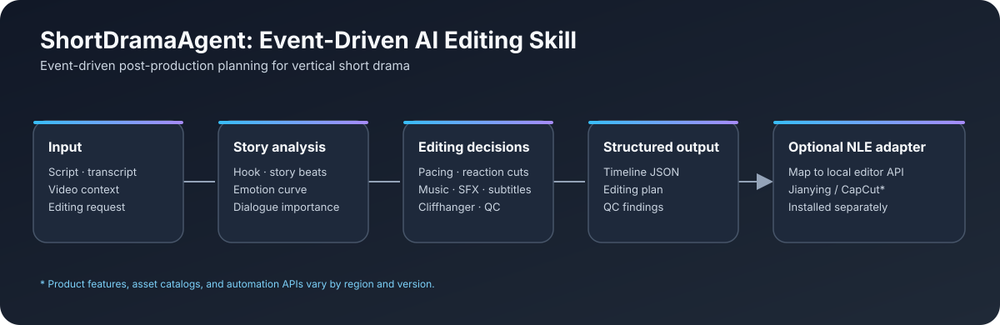

# ShortDramaAgent: Event-Driven AI Editing Skill

**An agent skill for event-driven post-production planning for vertical short drama.**

ShortDramaAgent: Event-Driven AI Editing Skill turns a script, transcript, or rough-cut review into structured editing decisions: story beats, emotion and pacing, dialogue trims, music and sound cues, reaction shots, cliffhangers, subtitles, continuity notes, and a QC checklist. It is a compact decision system that can pair with a separately installed non-linear editor workflow.



## What it includes

- Hook and story-event detection
- Emotion-curve and event-driven pacing guidance
- Dialogue pause and reaction-shot decisions
- Music ducking and event-based sound-effect cues
- Cliffhanger, subtitle, continuity, and quality checks
- A structured timeline example and Jianying sound-effect reference
- Optional integration guidance for an externally installed `jianying-editor`

## Workflow

1. Read a script, transcript, or available video context.
2. Identify the strongest hook, story beats, and emotional turns.
3. Produce editing, music, sound, subtitle, and continuity decisions.
4. Return a structured timeline plus an editing plan and QC result.
5. Optionally map the output to a local Jianying/CapCut workflow through a separately installed adapter.

## Repository layout

```text
ShortDramaAgent-Event-Driven-AI-Editing-Skill/
├── README.md
├── LICENSE
├── .gitignore
├── SKILL.md
├── docs/
│   └── architecture.svg
├── examples/
│   ├── editing-plan.md
│   ├── input-script.txt
│   └── timeline.json
└── references/
    ├── editing-examples.md
    ├── jianying-sfx-library.md
    └── timeline-schema.md
```

## Use the skill

Install or copy this directory into a location supported by your agent runtime's skills system. Then provide a script, transcript, or editing request and ask for a short-drama editing plan. The skill instructions are in [`SKILL.md`](SKILL.md); the output fields are described in [`references/timeline-schema.md`](references/timeline-schema.md).

The example timeline demonstrates the decision format. It does not include media paths or editor-specific API calls. A local adapter must map the decisions to the installed editor version.

### Optional Jianying integration

This repository does not bundle Jianying/CapCut, `jianying-editor`, media, music, or sound files. If `jianying-editor` is installed separately, set `JIANYING_EDITOR_SKILL_PATH` to its local directory and follow the integration notes in `SKILL.md`. Do not commit a machine-specific path. Jianying and CapCut features and asset catalogs may differ by region and version.

## 中文简介

ShortDramaAgent 是一个面向竖屏短剧后期策划的 Agent Skill。它根据剧本、转写文本或视频上下文，组织剧情节点、情绪曲线、节奏、对白停顿、配乐与音效、反应镜头、悬念、字幕、连续性检查和交付质检，并输出结构化时间轴与剪辑方案。

仓库只包含 Skill、文档和示例，不含剪映/CapCut 软件、自动化程序、视频、音乐或音效文件。`references/jianying-sfx-library.md` 中的音效名称可能随地区和应用版本变化，实际使用前请在目标应用内确认。

## License

MIT. See [`LICENSE`](LICENSE).
